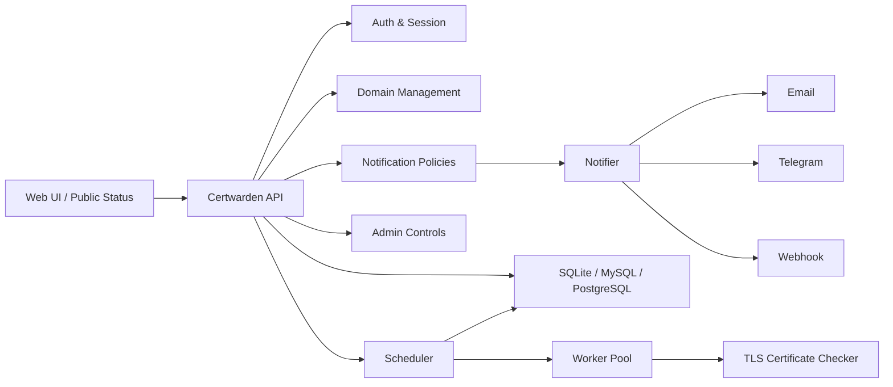

# Certwarden

<p align="center">
  <a href="./README.md">English</a> · <a href="./README-CN.md">简体中文</a>
</p>

<p align="center">
  
</p>

<p align="center">
  <strong>面向团队、平台和托管场景的多租户 SSL/TLS 证书监控系统。</strong>
</p>

<p align="center">
  公开状态页 · 用户名优先认证 · Email / Telegram / Webhook · Go 协程池 · React 管理台
</p>

<p align="center">
  <a href="https://github.com/luodaoyi/Certwarden/releases/tag/v1.0.0"></a>
  <a href="https://github.com/luodaoyi/Certwarden/releases/tag/v1.0.0"></a>
  <a href="https://github.com/luodaoyi/Certwarden/actions/workflows/ci.yml"></a>
  <a href="https://github.com/luodaoyi/Certwarden/actions/workflows/docker.yml"></a>
  <a href="https://github.com/luodaoyi/Certwarden/pkgs/container/certwarden"></a>
  <a href="https://github.com/luodaoyi/Certwarden/stargazers"></a>
  <a href="https://github.com/luodaoyi/Certwarden/forks"></a>
  <a href="./LICENSE"></a>
  
  
  
  
</p>

<p align="center">
  <a href="#快速开始"><strong>快速开始</strong></a> ·
  <a href="https://github.com/luodaoyi/Certwarden/releases/tag/v1.0.0"><strong>版本发布</strong></a> ·
  <a href="https://github.com/luodaoyi/Certwarden/pkgs/container/certwarden"><strong>容器镜像</strong></a> ·
  <a href="./README.md"><strong>English README</strong></a>
</p>

---

## 项目简介

Certwarden 是一个自托管的 SSL/TLS 证书监控平台，面向多租户运维场景设计。它可以持续检测证书健康状态与有效期，记录历史结果，驱动告警通知，并为每个租户生成独立的公开状态页。

它适合这些团队和场景：

- 需要统一管理大量 HTTPS 域名证书的企业与运维团队
- 需要租户隔离的 SaaS / 托管平台
- 需要对外展示证书状态的客户状态页场景
- 希望用单个 `docker-compose.yml` 快速部署的自托管用户

## 为什么选择 Certwarden

| 监控 | 告警 | 展示 |
| --- | --- | --- |
| 检测证书到期时间、颁发机构、CN、SAN、指纹与有效期窗口。 | 通过 Email、Telegram、Webhook 发送租户级或域名级告警。 | 为每个租户生成独立公开状态页，并支持自定义标题与副标题。 |

| 调度 | 隔离 | 部署 |
| --- | --- | --- |
| 使用 Go 调度器与协程池执行定时检测。 | 在共享数据库中通过 `tenant_id` 隔离数据。 | 默认 SQLite，支持单文件 Compose 启动，也可切换 MySQL / PostgreSQL。 |

## 核心能力

- **多租户架构**：单库共享表 + `tenant_id` 隔离，账号即租户
- **用户名优先认证**：注册仅需用户名和密码，邮箱是可选绑定信息
- **丰富证书详情**：生效时间、到期时间、颁发机构、主题、CN、SAN、序列号、SHA-256 指纹、签名算法
- **目标 IP 指定检测**：可固定检测 IP，同时保留主机名作为 SNI
- **租户公开状态页**：每个租户自动拥有 `/status/{tenantId}` 页面
- **通知端点测试**：可在界面中直接测试 Email、Telegram、Webhook 是否可达
- **租户自定义 Telegram Bot**：每个 Telegram 端点可单独配置 Bot Token 与 Chat ID
- **管理员后台**：支持租户管理、禁用访问、删除租户、重置密码
- **多语言界面**：English、简体中文、繁體中文、Español、Français、Deutsch、Русский、العربية、Português、日本語、한국어、हिन्दी、Italiano

## 界面预览

| 登录页 | 租户后台 |
| --- | --- |
|  |  |

| 公开状态页 | 管理后台 |
| --- | --- |
|  |  |

## 系统架构



## 快速开始

### 使用 Docker Compose 部署

```bash
cp .env.example .env
docker compose up -d
```

如果你希望固定版本镜像：

```bash
CERTWARDEN_IMAGE=ghcr.io/luodaoyi/certwarden:v1.0.0
```

默认对外端口：

- `8080`：前端 + API

### 本地开发

```bash
cp .env.example .env
```

后端：

```bash
cd apps/api
go run ./cmd/server
```

前端：

```bash
cd apps/web
npm install
npm run dev
```

## 默认初始化管理员

示例环境变量会默认初始化一个超级管理员：

- 用户名：`admin`
- 密码：`admin`

生产环境部署前请务必修改。

## 关键环境变量

| 变量 | 说明 | 默认值 |
| --- | --- | --- |
| `CERTWARDEN_IMAGE` | Compose 使用的镜像地址 | `ghcr.io/luodaoyi/certwarden:latest` |
| `APP_ADDR` | HTTP 监听地址 | `:8080` |
| `APP_BASE_URL` | 对外访问地址 | `http://localhost:8080` |
| `DB_DRIVER` | 数据库驱动 | `sqlite` |
| `DATABASE_URL` | 数据库连接串或文件路径 | `data/certwarden.db` |
| `ALLOW_REGISTRATION` | 是否允许公开注册 | `true` |
| `BOOTSTRAP_ADMIN_USERNAME` | 初始管理员用户名 | `admin` |
| `BOOTSTRAP_ADMIN_EMAIL` | 初始管理员联系邮箱 | 空 |
| `BOOTSTRAP_ADMIN_PASSWORD` | 初始管理员密码 | `admin` |
| `SCAN_CONCURRENCY` | 检测协程池大小 | `5` |
| `SCAN_INTERVAL` | 调度器扫描周期 | `1h` |
| `SMTP_*` | SMTP 配置 | 空 |
| `TELEGRAM_BOT_TOKEN` | 可选全局 Telegram Token | 空 |
| `WEBHOOK_TIMEOUT` | Webhook 超时 | `5s` |

## 仓库结构

```text
.
├─ apps/
│  ├─ api/     # Go API + scheduler + worker pool
│  └─ web/     # React + Vite + Tailwind 前端
├─ docs/
│  ├─ branding/
│  └─ screenshots/
├─ deploy/
├─ .github/workflows/
├─ docker-compose.yml
└─ Dockerfile
```

## 许可证

本项目使用 [MIT License](./LICENSE)。
