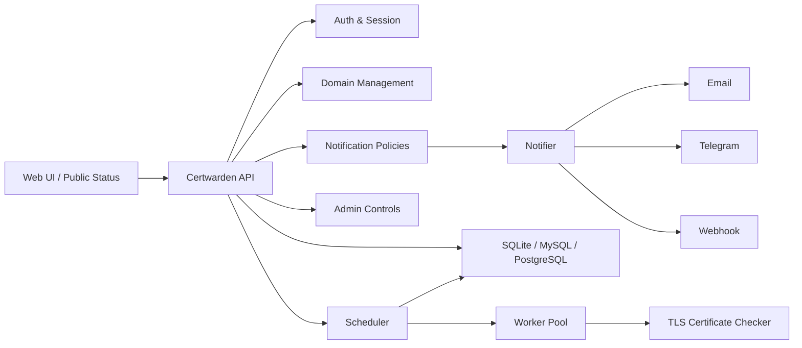

# Certwarden

<p align="center">
  
</p>

<p align="center">
  一个面向团队、运维平台和托管场景的多租户 SSL/TLS 证书监控系统。
</p>

<p align="center">
  用户名注册登录 · 租户级公开状态页 · Email / Telegram / Webhook · Go 协程池检测 · React 管理台
</p>

## 项目概览

Certwarden 用来持续检测 HTTPS / TLS 证书的状态、有效期和告警阈值，并把结果沉淀成租户后台与公开状态页。

它适合这些场景：

- 企业或运维团队统一管理多个域名证书
- SaaS / 托管平台按租户隔离证书资产和告警策略
- 需要类似状态页的对外证书展示入口
- 希望用单 `docker-compose.yml` 快速上线并默认使用 SQLite

## 界面预览

| Login | Tenant Workspace |
| --- | --- |
|  |  |

| Public Status Page | Admin Console |
| --- | --- |
|  |  |

## 核心能力

- 多租户证书监控：单库共享表 + `tenant_id` 隔离，账号即租户
- 租户级公开状态页：每个租户自动拥有独立状态页，路径为 `/status/{tenantId}`
- 用户名优先认证：注册只需要用户名和密码，邮箱为可选绑定信息
- 证书详情展示：有效起始时间、到期时间、颁发机构、主题、CN、SAN、序列号、指纹、签名算法
- IP 指定检测：可为域名固定检测 IP，检测时仍使用主机名作为 SNI；未指定时自动走 DNS
- 告警渠道：Email、Telegram、Webhook
- 告警策略：租户默认阈值 + 域名级覆盖
- 检测调度：Go 调度器 + 协程池按 `next_check_at` 派发任务
- 历史记录：保存每次证书检测结果并回写当前域名状态
- 管理后台：独立 `/admin` 后台，支持禁用租户、删除租户、重置租户密码
- 部署方式：SQLite / MySQL / PostgreSQL，支持 Docker Compose、1Panel Compose 导入、GitHub Actions CI/CD

## 证书检测模型

- 域名字段：`hostname + optional port + optional target_ip`
- 检测周期：前端提供 `1 / 3 / 7 / 14 / 30` 天预设，并允许直接输入自定义秒数
- 手动检测：租户可即时触发单域名检测
- 自动检测：调度器按 `next_check_at` 持续派发任务
- 公开展示：租户公开状态页会显示整体状态、下一张即将到期的证书，以及每个域名的详细证书信息

## 系统架构



## 快速开始

### 1. 本地开发

```bash
cp .env.example .env
```

启动后端：

```bash
cd apps/api
go run ./cmd/server
```

启动前端：

```bash
cd apps/web
npm install
npm run dev
```

### 2. Docker Compose

默认 `docker-compose.yml` 直接使用预构建镜像，不依赖本地 `build`。复制 `docker-compose.yml` 和 `.env` 后可直接启动。

```bash
cp .env.example .env
docker compose up -d
```

如果你要固定某个版本镜像，可以在 `.env` 里覆盖：

```bash
CERTWARDEN_IMAGE=ghcr.io/luodaoyi/certwarden:latest
```

默认对外端口：

- `8080`：前端 + API

### 3. 验证命令

```bash
make api-test
make web-test
make lint
make build
```

## 默认管理员

`.env.example` 默认会初始化一个超级管理员：

- 用户名：`admin`
- 密码：`admin`

生产环境部署前请务必修改。

## 关键环境变量

| 变量 | 说明 | 默认值 |
| --- | --- | --- |
| `CERTWARDEN_IMAGE` | Docker Compose 使用的镜像地址 | `ghcr.io/luodaoyi/certwarden:latest` |
| `APP_ADDR` | HTTP 监听地址 | `:8080` |
| `APP_BASE_URL` | 对外访问地址 | `http://localhost:8080` |
| `DB_DRIVER` | 数据库驱动 | `sqlite` |
| `DATABASE_URL` | 数据库连接串 / 文件路径 | `data/certwarden.db` |
| `ALLOW_REGISTRATION` | 是否允许公开注册 | `true` |
| `BOOTSTRAP_ADMIN_USERNAME` | 初始管理员用户名 | `admin` |
| `BOOTSTRAP_ADMIN_EMAIL` | 初始管理员联系邮箱，可留空 | 空 |
| `BOOTSTRAP_ADMIN_PASSWORD` | 初始管理员密码 | `admin` |
| `SCAN_CONCURRENCY` | 检测协程池大小 | `5` |
| `SCAN_INTERVAL` | 调度器扫描周期 | `1h` |
| `SMTP_*` | SMTP 配置 | 空 |
| `TELEGRAM_BOT_TOKEN` | Telegram Bot Token | 空 |
| `WEBHOOK_TIMEOUT` | Webhook 超时 | `5s` |

## 数据库与部署

- 开发默认数据库：SQLite
- 支持数据库：SQLite / MySQL / PostgreSQL
- 1Panel：第一版直接按 Compose 导入部署
- GitHub Actions：包含前后端测试、构建校验和镜像发布

## 仓库结构

```text
.
├─ apps/
│  ├─ api/     # Go API + scheduler + worker pool
│  └─ web/     # React + Vite + Tailwind 前端
├─ docs/
│  ├─ branding/
│  └─ screenshots/
├─ deploy/
├─ .github/workflows/
├─ docker-compose.yml
└─ Dockerfile
```

## 技术栈

- Backend: Go, chi, GORM, gormigrate
- Frontend: React, Vite, Tailwind CSS, React Router, TanStack Query, React Hook Form, Zod
- Database: SQLite / MySQL / PostgreSQL
- Delivery: Docker Compose, GitHub Actions, GHCR
