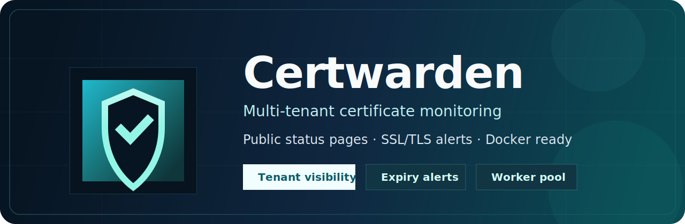
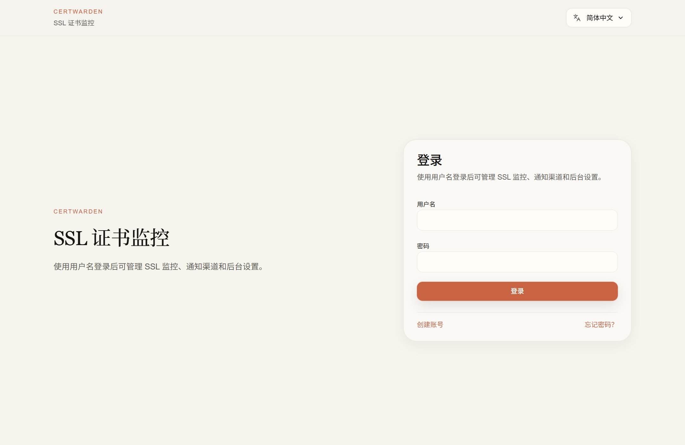
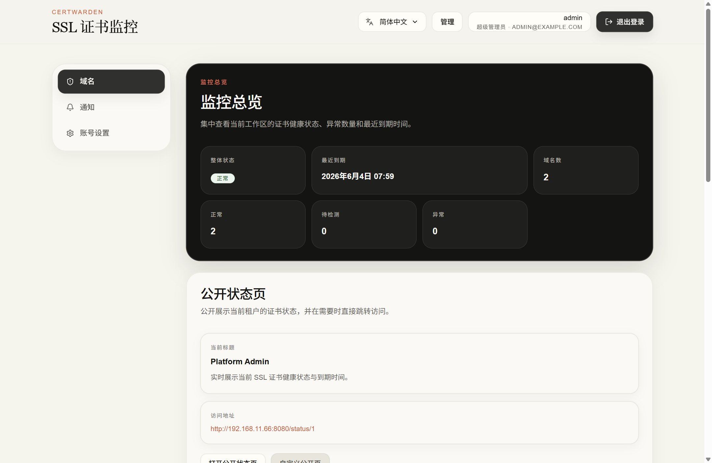
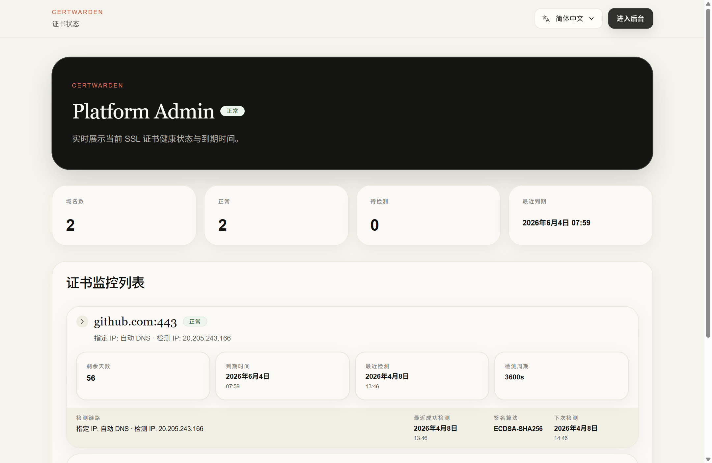
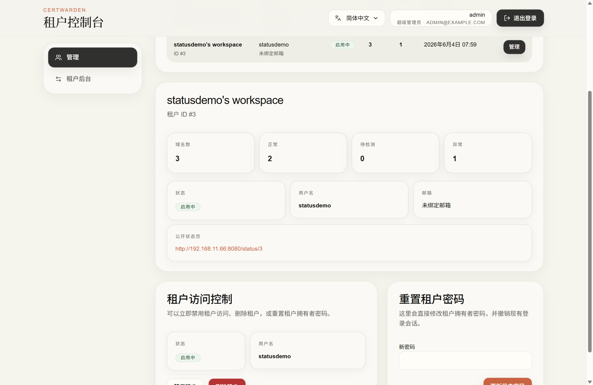
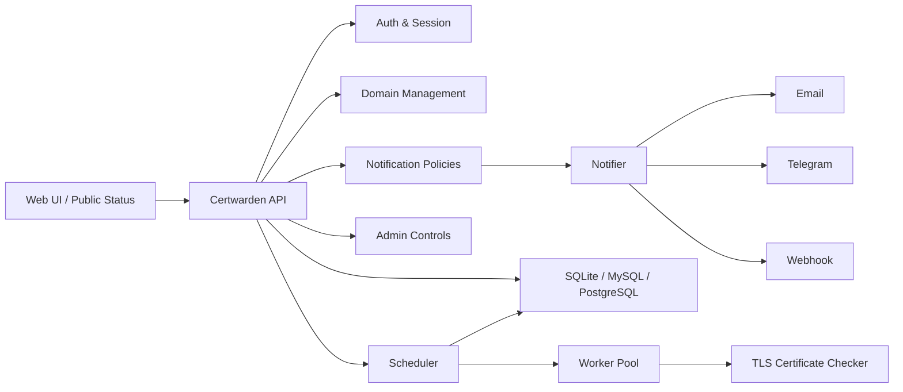
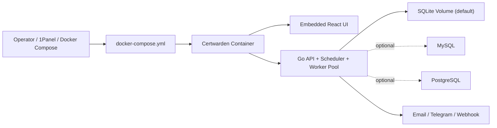

# Certwarden

<p align="center">
  <a href="./README.md">English</a> · <a href="./README-CN.md">简体中文</a>
</p>

<p align="center">
  
</p>

<p align="center">
  <strong>Multi-tenant SSL/TLS certificate monitoring for teams, platforms, and managed services.</strong>
</p>

<p align="center">
  Public status pages · Username-first auth · Email / Telegram / Webhook · Go worker pool · React admin console
</p>

<p align="center">
  <a href="https://github.com/luodaoyi/Certwarden/releases/tag/v1.0.0"></a>
  <a href="https://github.com/luodaoyi/Certwarden/releases/tag/v1.0.0"></a>
  <a href="https://github.com/luodaoyi/Certwarden/actions/workflows/ci.yml"></a>
  <a href="https://github.com/luodaoyi/Certwarden/actions/workflows/docker.yml"></a>
  <a href="https://github.com/luodaoyi/Certwarden/pkgs/container/certwarden"></a>
  <a href="https://github.com/luodaoyi/Certwarden/stargazers"></a>
  <a href="https://github.com/luodaoyi/Certwarden/forks"></a>
  <a href="./LICENSE"></a>
  
  
  
  
</p>

<p align="center">
  <a href="#quick-start"><strong>Quick Start</strong></a> ·
  <a href="https://github.com/luodaoyi/Certwarden/releases/tag/v1.0.0"><strong>Release Notes</strong></a> ·
  <a href="https://github.com/luodaoyi/Certwarden/pkgs/container/certwarden"><strong>Container Image</strong></a> ·
  <a href="./README-CN.md"><strong>中文文档</strong></a>
</p>

---

## Overview

Certwarden is a self-hosted SSL/TLS certificate monitoring platform designed for multi-tenant operations. It continuously checks certificate health, stores historical results, drives alert workflows, and publishes tenant-specific public status pages.

It fits teams that need:

- centralized monitoring for many HTTPS endpoints
- tenant isolation for SaaS or managed hosting environments
- customer-facing certificate status pages
- simple deployment with a single `docker-compose.yml`

## Why Certwarden

| Monitor | Alert | Publish |
| --- | --- | --- |
| Track certificate expiry, issuer, CN, SAN, fingerprints, and validation windows. | Route alerts to Email, Telegram, or generic Webhook with tenant-level and domain-level policies. | Expose a dedicated public status page per tenant with customizable title and subtitle. |

| Operate | Isolate | Deploy |
| --- | --- | --- |
| Run scheduled checks through a Go scheduler and worker pool. | Share one database while isolating data with `tenant_id`. | Start with SQLite by default, or switch to MySQL / PostgreSQL when needed. |

## Product Highlights

- **Multi-tenant architecture** — account-as-tenant model with shared tables and strict `tenant_id` scoping
- **Username-first authentication** — users register with username + password; email is optional
- **Rich certificate details** — valid-from, expiry, issuer, subject, CN, SAN, serial number, SHA-256 fingerprint, signature algorithm
- **Target IP override** — check a fixed IP while preserving hostname-based SNI
- **Public status pages** — every tenant gets an independent `/status/{tenantId}` page
- **Notification endpoint testing** — verify Email, Telegram, and Webhook delivery from the UI
- **Tenant-managed Telegram bots** — each endpoint can use its own Bot Token and Chat ID
- **Admin console** — manage tenants, disable access, delete tenants, and reset passwords
- **Internationalized UI** — English, 简体中文, 繁體中文, Español, Français, Deutsch, Русский, العربية, Português, 日本語, 한국어, हिन्दी, Italiano

## Product Tour

<table>
  <tr>
    <td width="50%" align="center" valign="top">
      
      <br />
      <sub><strong>Login</strong> — username-first authentication with a clean operator-focused entry point.</sub>
    </td>
    <td width="50%" align="center" valign="top">
      
      <br />
      <sub><strong>Tenant Workspace</strong> — track domain status, expiry windows, and certificate details in one place.</sub>
    </td>
  </tr>
  <tr>
    <td width="50%" align="center" valign="top">
      
      <br />
      <sub><strong>Public Status Page</strong> — publish tenant-facing certificate status with custom title and subtitle.</sub>
    </td>
    <td width="50%" align="center" valign="top">
      
      <br />
      <sub><strong>Admin Console</strong> — manage tenants, access control, and password resets from a dedicated backend.</sub>
    </td>
  </tr>
</table>

## Start in Minutes

| Option | Best for | What you do |
| --- | --- | --- |
| Docker Compose | Fast self-hosted deployment | Copy `.env.example`, then run `docker compose up -d` |
| 1Panel | Panel-based deployment | Import the included Compose file and configure environment variables in the panel |
| Local development | Feature work and debugging | Run Go API and Vite frontend separately from `apps/api` and `apps/web` |

## Documentation

- [English README](./README.md)
- [简体中文 README](./README-CN.md)
- [v1.0.0 Release Notes](https://github.com/luodaoyi/Certwarden/releases/tag/v1.0.0)
- [GHCR Container Package](https://github.com/luodaoyi/Certwarden/pkgs/container/certwarden)

## Architecture



## Deployment Model



## Quick Start

### Deploy with Docker Compose

```bash
cp .env.example .env
docker compose up -d
```

To pin the image version explicitly:

```bash
CERTWARDEN_IMAGE=ghcr.io/luodaoyi/certwarden:v1.0.0
```

Default exposed port:

- `8080` — frontend + API

### Deploy with 1Panel

Certwarden can also be deployed by importing the repository `docker-compose.yml` into 1Panel. The first release is intentionally kept Compose-friendly so it can be used directly without creating a custom marketplace package.

Recommended flow:

1. import `docker-compose.yml`
2. copy values from `.env.example`
3. set `APP_BASE_URL`, database settings, and bootstrap admin credentials
4. start the stack from the panel

### Local Development

```bash
cp .env.example .env
```

Backend:

```bash
cd apps/api
go run ./cmd/server
```

Frontend:

```bash
cd apps/web
npm install
npm run dev
```

## Default Bootstrap Admin

The example environment file initializes a super admin by default:

- username: `admin`
- password: `admin`

Change these values before production use.

## Key Environment Variables

| Variable | Description | Default |
| --- | --- | --- |
| `CERTWARDEN_IMAGE` | Docker image used by Compose | `ghcr.io/luodaoyi/certwarden:latest` |
| `APP_ADDR` | HTTP listen address | `:8080` |
| `APP_BASE_URL` | Public base URL | `http://localhost:8080` |
| `DB_DRIVER` | Database driver | `sqlite` |
| `DATABASE_URL` | Connection string or file path | `data/certwarden.db` |
| `ALLOW_REGISTRATION` | Allow public registration | `true` |
| `BOOTSTRAP_ADMIN_USERNAME` | Initial admin username | `admin` |
| `BOOTSTRAP_ADMIN_EMAIL` | Initial admin contact email | empty |
| `BOOTSTRAP_ADMIN_PASSWORD` | Initial admin password | `admin` |
| `SCAN_CONCURRENCY` | Worker pool size | `5` |
| `SCAN_INTERVAL` | Scheduler interval | `1h` |
| `SMTP_*` | SMTP settings | empty |
| `TELEGRAM_BOT_TOKEN` | Optional global Telegram token | empty |
| `WEBHOOK_TIMEOUT` | Webhook timeout | `5s` |

## Repository Layout

```text
.
├─ apps/
│  ├─ api/     # Go API + scheduler + worker pool
│  └─ web/     # React + Vite + Tailwind frontend
├─ docs/
│  ├─ branding/
│  └─ screenshots/
├─ deploy/
├─ .github/workflows/
├─ docker-compose.yml
└─ Dockerfile
```

## License

Released under the [MIT License](./LICENSE).
